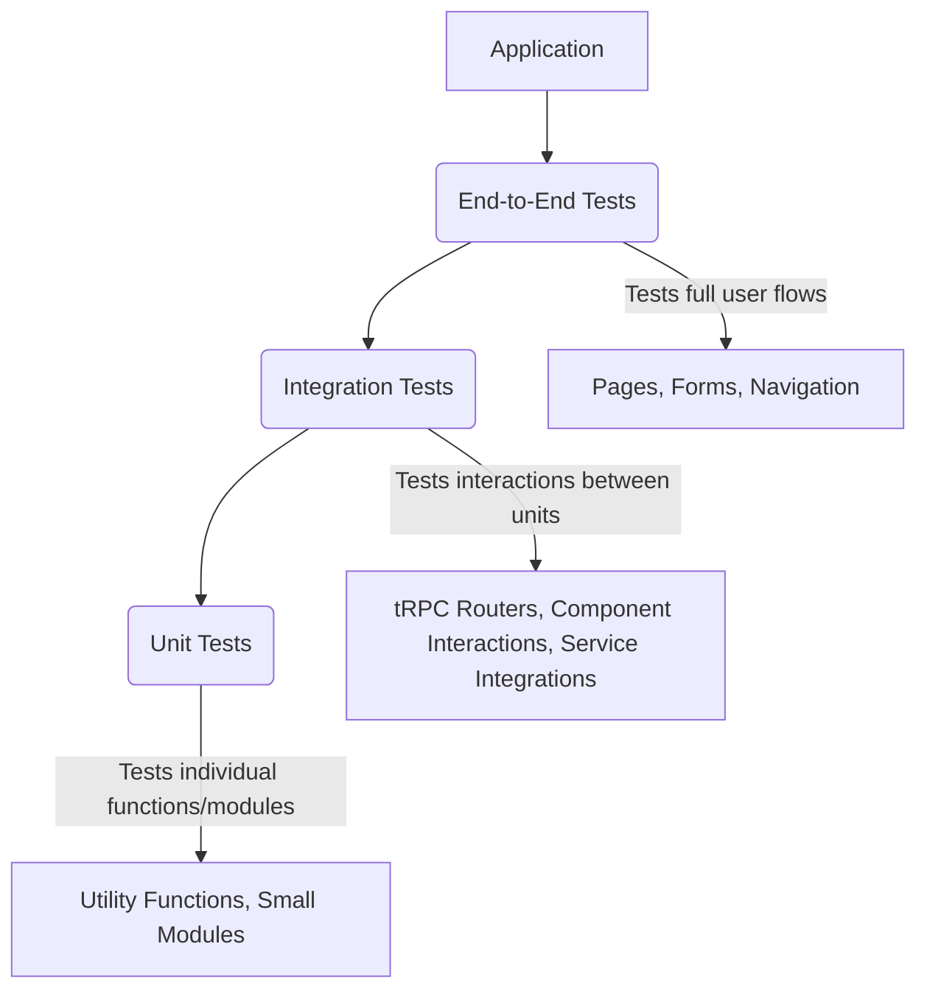

# Testing Setup Plan

This document outlines the plan for setting up a comprehensive testing suite for the application, covering unit, integration, and end-to-end tests.

## 1. Choose Testing Frameworks

*   **Unit/Integration Tests:** Jest and React Testing Library.
    *   Jest: A JavaScript testing framework for writing unit and integration tests.
    *   React Testing Library: Provides utilities for testing React components in a user-centric way.
*   **End-to-End Tests:** Playwright.
    *   Playwright: A robust framework for end-to-end testing of web applications across multiple browsers.

## 2. Install Dependencies

The following dependencies will be added to the `devDependencies` in `package.json`:

*   `jest`
*   `@types/jest`
*   `ts-jest`
*   `react-testing-library`
*   `@testing-library/react`
*   `@testing-library/jest-dom`
*   `playwright/test`
*   `@playwright/test`

## 3. Configure Testing Environment

*   **Jest:** Create a `jest.config.js` file at the project root. Configure it to use `ts-jest` for TypeScript support and include setup for `@testing-library/jest-dom`.
*   **Playwright:** Initialize Playwright using its CLI (`npx playwright install`) which will create `playwright.config.ts` and set up necessary browsers.

## 4. Structure Test Files

*   **Unit/Integration Tests:** Test files will be placed in `__tests__` directories alongside the code they are testing (e.g., `src/lib/__tests__`, `src/components/__tests__`, `src/lib/trpc/routers/__tests__`). Files will typically follow the naming convention `*.test.ts` or `*.test.tsx`.
*   **End-to-End Tests:** End-to-end test files will be placed in a dedicated `e2e` directory at the project root. Files will typically follow the naming convention `*.spec.ts`.

## 5. Write Tests

*   **Unit Tests:**
    *   Focus on isolated functions and modules.
    *   Examples: Utility functions in `src/lib/utils.ts`, helper functions, data transformation logic.
*   **Integration Tests:**
    *   Test the interaction between multiple units or layers.
    *   Examples: tRPC router procedures (`src/lib/trpc/routers/`) interacting with Appwrite services (requires mocking Appwrite), components interacting with hooks or context, API routes (`src/app/api/`).
    *   Mock external dependencies like Appwrite, Redis, or external APIs to ensure tests are fast and reliable.
*   **Component Tests:**
    *   Test individual React components using React Testing Library.
    *   Focus on rendering, user interactions (clicking buttons, typing in inputs), and ensuring the component behaves as expected based on props and state.
    *   Examples: Components in `src/components/`.
*   **End-to-End Tests:**
    *   Test complete user flows through the application using Playwright.
    *   Simulate real user interactions in a browser environment.
    *   Examples: User registration and login, creating/editing a business listing, searching for listings, submitting a review, payment flows.

## 6. Add Test Scripts

Add scripts to the `scripts` section of `package.json` to run the tests:

*   `test:unit`: Command to run Jest for unit/integration/component tests.
*   `test:e2e`: Command to run Playwright end-to-end tests.
*   `test`: A combined script to run all tests.

## 7. Integrate into CI/CD (Future Consideration)

*   Configure your CI/CD pipeline (e.g., Vercel, GitHub Actions) to automatically run the test scripts on relevant events (e.g., pull requests, pushes to main branch) to catch regressions early.

## Appwrite Instances for Testing

It is recommended to set up separate Appwrite instances for testing environments to isolate test data from development or production data. This ensures test repeatability and prevents data corruption. Configuration for connecting to the appropriate Appwrite instance will be managed via environment variables (e.g., `.env.test`).

