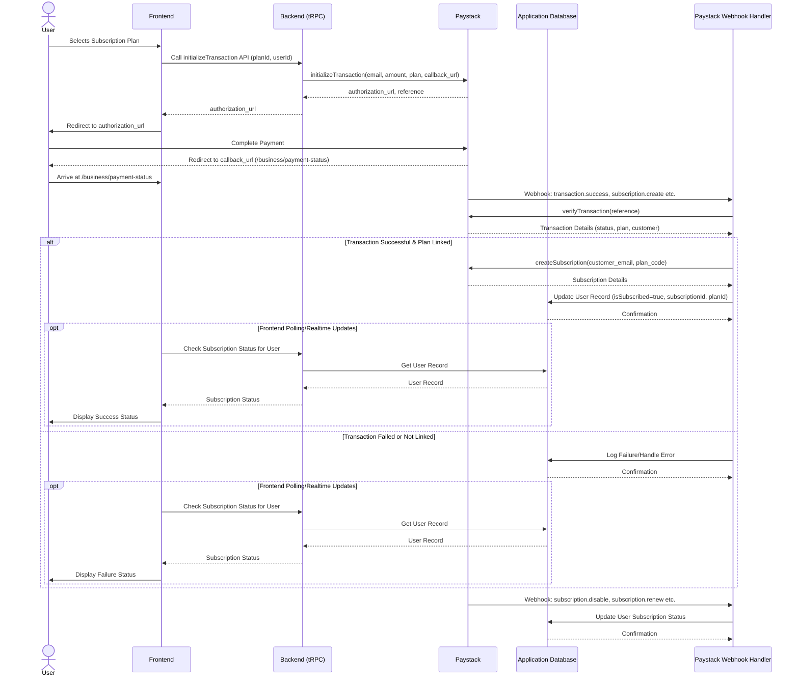

# Paystack Subscription Handling Flow

This document outlines the flow for handling user subscriptions using Paystack, triggered when a user selects a subscription plan on a pricing page.

## Flow Diagram

## Steps:

1.  **Display Subscription Plans:**
    *   Fetch available plans from Paystack using the `listPlans` function in [`src/lib/paystack/index.ts`](src/lib/paystack/index.ts:1).
    *   Display these plans on a pricing page in the application's frontend.

2.  **Initiate Subscription Transaction:**
    *   When a user selects a plan and initiates the subscription process on the frontend, call a backend API endpoint (likely a tRPC router in [`src/lib/trpc/routers/paystack.ts`](src/lib/trpc/routers/paystack.ts:1)) to initialize a transaction with Paystack.
    *   This backend endpoint will use the `initializeTransaction` function from [`src/lib/paystack/index.ts`](src/lib/paystack/index.ts:1), providing the user's email, the plan code, and a callback URL.
    *   The callback URL should point to a page in the application that will handle the post-payment redirect from Paystack (e.g., `/business/payment-status`).
    *   The response from `initializeTransaction` will contain an `authorization_url`. Return this URL to the frontend.

3.  **User Redirection and Payment:**
    *   The frontend will redirect the user to the `authorization_url` provided by Paystack.
    *   The user completes the payment on the Paystack hosted page.

4.  **Handle Paystack Callback/Webhook:**
    *   Paystack will redirect the user back to the specified `callback_url` (`/business/payment-status`). This page will likely receive a transaction reference in the URL parameters.
    *   Crucially, Paystack will also send a server-to-server webhook notification to the endpoint defined in [`src/app/api/webhooks/paystack/route.ts`](src/app/api/webhooks/paystack/route.ts:1). This is the primary method for confirming the transaction status securely.

5.  **Verify Transaction (Webhook):**
    *   The webhook handler in [`src/app/api/webhooks/paystack/route.ts`](src/app/api/webhooks/paystack/route.ts:1) will receive the transaction details from Paystack.
    *   It should verify the authenticity of the webhook (using Paystack's signature verification).
    *   It will then use the `verifyTransaction` function from [`src/lib/paystack/index.ts`](src/lib/paystack/index.ts:1) with the transaction reference received in the webhook payload to get the definitive status of the transaction directly from Paystack.

6.  **Create Subscription and Update User Status (Webhook):**
    *   If the transaction verification is successful and the transaction status indicates a successful payment for a plan, the webhook handler will proceed to create a subscription in Paystack using the `createSubscription` function from [`src/lib/paystack/index.ts`](src/lib/paystack/index.ts:1). This will require the customer's email (from the transaction details) and the plan code.
    *   After successfully creating the subscription in Paystack, update the corresponding user's record in the application's database (likely using Appwrite services based on the file structure) to mark them as subscribed and potentially store the Paystack subscription code and plan details.

7.  **Handle Subscription Status Changes (Webhooks):**
    *   The webhook handler in [`src/app/api/webhooks/paystack/route.ts`](src/app/api/webhooks/paystack/route.ts:1) will also receive notifications for other subscription lifecycle events (e.g., `subscription.create`, `subscription.notif`, `subscription.renew`, `subscription.disable`, `subscription.enable`).
    *   Implement logic within the webhook handler to process these events and update the user's subscription status in the application database accordingly. For example, on `subscription.disable`, update the user's record to reflect an inactive subscription.

8.  **Frontend Payment Status Page:**
    *   The `/business/payment-status` page that the user is redirected to after payment can display a pending status while waiting for the webhook to confirm the transaction and subscription creation.
    *   It can poll the backend or listen for real-time updates (if implemented) to show the final status of the subscription to the user.